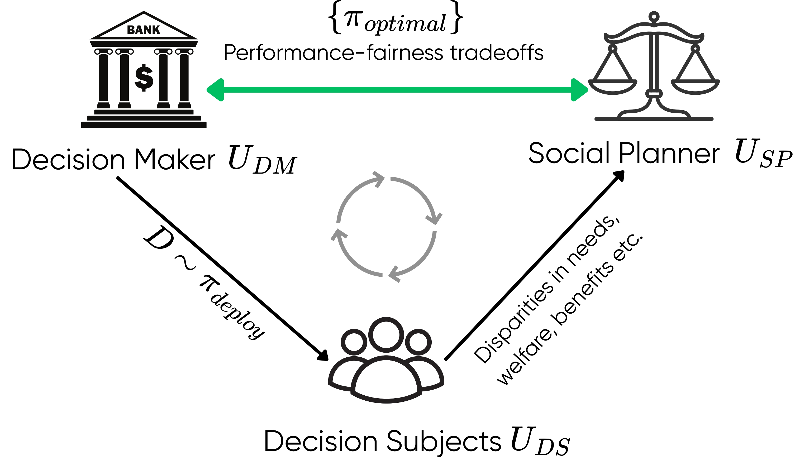

# First-See-Then-Design: A Multi-Stakeholder View for Optimal Performance-Fairness Trade-Offs

This repository contains the code implementing the MOO approach for Multi-stakeholder setup introduced in the paper : First-See-Then-Design: A Multi-Stakeholder View for Optimal Performance-Fairness Trade-Offs accepted at the ACM FAccT 2026 conference. Check out the full paper at this link.




## Overview 

## Setup 


## Running Experiments

## 1. Dataset Preparation

### Real-world datasets
To run experiments on real-world datasets:

1. Download the datasets (see dataset-specific instructions if provided).
2. Run the corresponding notebook (e.g. `create_german_credit.ipynb`) to:
   - Train the model that estimates outcome probabilities.
   - Generate the train/test splits used in the paper.

> **Note:** Some real-world datasets cannot be publicly shared due to licensing or privacy restrictions. The data splits used in the paper are available upon request — alternatively, you can create them using the provided notebooks.

### Synthetic datasets
Synthetic datasets are already prepared and available in the `data/` directory. No additional preprocessing is required.

---

## 2. Running Policy Sweep Experiments

To run policy sweep experiments for a specific configuration, use the following command:

```bash
python scripts/compare_policies_viz.py \
  --config <path_to_config.yaml> \
  --data <path_to_training_data> \
  --test_data <path_to_testing_data> \
  --outdir <output_directory>
```

## Configurations

Config files (`.yaml`) contain:
- **thresholds**: Number of thresholds (tau for deterministic, gamma for stochastic policies), in the range `(0.1, 0.99)`.
- **sigmas**: Used for stochastic policies (also called betas). Larger values make the policy closer to deterministic.
- **XYZ_costs**: Constants used in the utility functions. These can be fixed (e.g., MIMIC) or dataset-dependent (e.g., Home Credit).

---

# Results

Results are stored in the directory specified by `--outdir`.

- **`all_policies/`**
  - `train_*.csv`: Results of each policy type from the sweep evaluated on training data.
  - `test_*.csv`: Evaluation on test data of Pareto-optimal policies identified during training.

- **Pareto fronts**
  - `train_pf_*.csv`, `test_pf_*.csv`: Pareto-optimal policies (visualized in the paper).

- The JSON files include **Fairness AUC** and **Hypervolume**.

**Metrics**
- `Disparity`: Egalitarian utility  
- `min_group_u`: Rawlsian utility


## Citation

